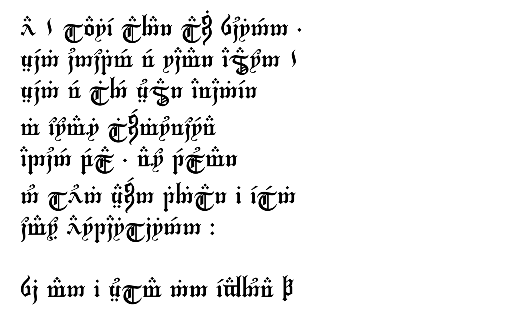

# Tengwar Rácina
Tengwar font using glyphs from Enrique Mombello's *Tengwar Gothika* and Fredrick Brennan's [_Chomsky_](https://github.com/ctrlcctrlv/chomsky), mapped to Unicode according to [this](https://freetengwar.sourceforge.net/mapping.html) proposal.

